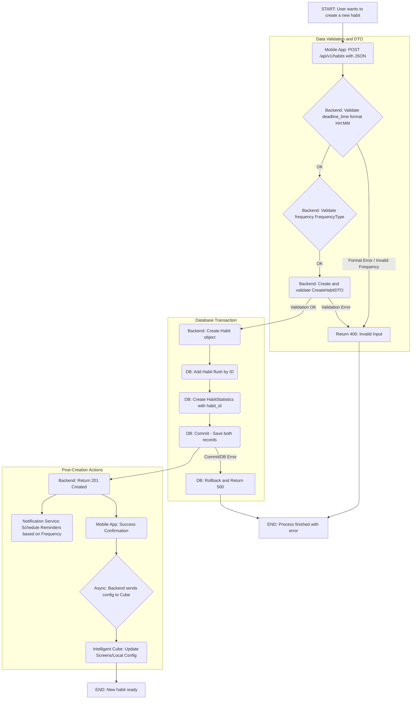
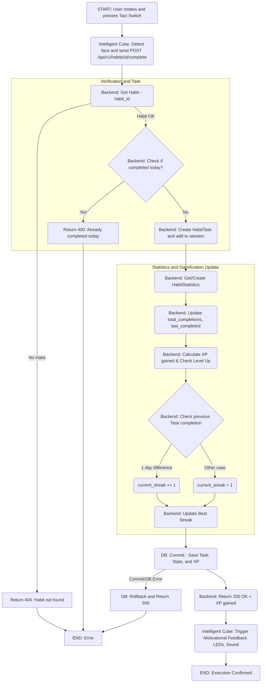
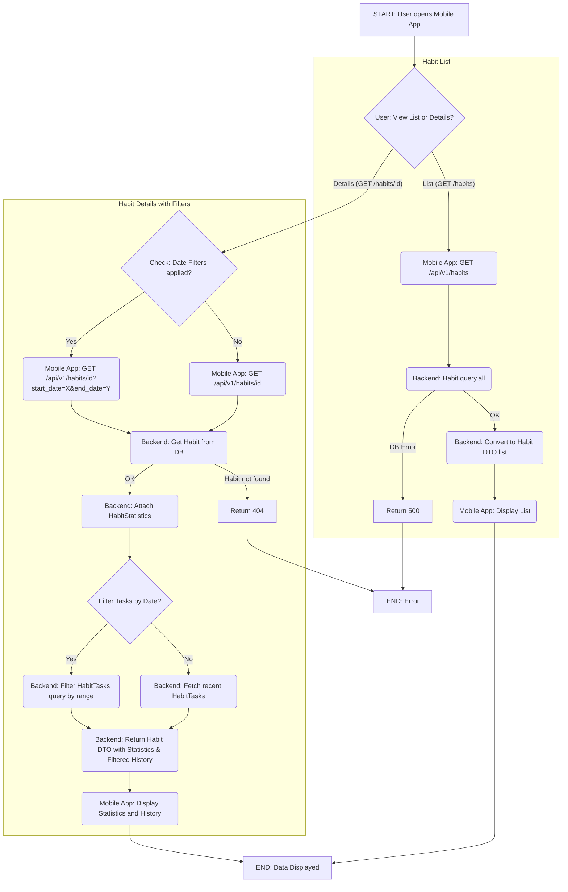

# HabCube

## Description

The "Intelligent Cube" is an IoT device that supports users in forming and maintaining daily habits. Habits are defined in a mobile application, which allows for configuration and the presentation of statistics regarding progress.

## Introduction

The goal of this project is to create a complete Internet of Things (IoT) system designed to operate on a local network. The system combines hardware (the physical cube) with a mobile application that allows users to define, configure, and track their habits, as well as view statistics on their progress.

The project integrates knowledge from electronics, computer science, network programming, and embedded systems engineering. The work covers both the hardware layer (the cube's design and implementation) and the software layer (server-side communication, backend, mobile user interface, and overall system integration).

## Project Goals

### General Goals
- To create a fully functional IoT system operating within a local network.
- To achieve high effectiveness in helping users build and sustain positive habits.
- To design a system that increases user motivation and engagement in the process of self-improvement.
- To develop a final product that genuinely improves users' quality of life by supporting them in achieving their habit-related goals.

### Educational Goals
- To understand the practical aspects of building end-to-end IoT systems.
- To learn how to integrate hardware and software into a single cohesive system.
- To develop teamwork and project management skills.
- To gain experience in planning, implementing, testing, and documenting a complex technical project.
- To learn which motivational mechanisms are most effective in habit formation and how to design engaging and intuitive user interactions.

## Project Scope

### Key Features
- **Habit Configuration**: Defining and managing habits through a mobile application.
- **Progress Tracking**: Monitoring user progress and presenting it through statistics.
- **Motivational Feedback**: Providing users with visual, sound, and light-based "dopamine hits" to reinforce positive actions.

### System Architecture
The system consists of three main components:
1.  **The Intelligent Cube**: A physical device based on an ESP32 microcontroller that acts as the primary user interaction point.
2.  **Central Server**: A backend service responsible for handling communication with the cube, processing data, and storing user statistics.
3.  **Mobile Application**: A user interface for configuring the cube, defining habits, and viewing progress data.

All components communicate over a local Wi-Fi network.

---

## Tools and Technologies

### Software / Backend
* **Language:** Python 3.9+
* **Framework:** Flask
* **Database ORM:** SQLAlchemy
* **API Documentation:** Flasgger (Swagger UI)
* **Serialization:** Python Dataclasses (DTOs)
* **Deployment:** Google Cloud Run (Dockerized)

### Mobile App / UI
* **Framework:** React Native (Expo)
* **Language:** TypeScript
* **Navigation:** React Navigation
* **HTTP Client:** Axios
* **State Management:** React Hooks (Custom Hooks)
* **UI Components:** React Native Vector Icons (Ionicons), Safe Area Context

### 3D Design & Manufacturing
* **Software:** Autodesk Fusion 360
* **Files:** `HabCube.f3z` (Source), `.stl` (Production)
* **Method:** FDM 3D Printing (PLA/PETG)
* **Components:**
    * `new_cube.stl`: Main frame with screen mounts.
    * `new_cap.stl`: Protective lid/cover.

### Database
* **Engine:** PostgreSQL 13+
* **Production:** Google Cloud SQL
* **Caching:** Redis (Google Cloud Memorystore)

### Hardware
* **Microcontroller:** ESP32
* **Peripherals:** 4 OLED Screens (I2C, SPI), Gyroscope, Multiplexer, 2 Tact switches, Audio amplifier, Speaker, LEDs.

### DevOps & Management
* **Containerization:** Docker, Docker Compose
* **CI/CD:** GitHub Actions
* **Version Control:** Git, GitHub
* **Project Management:** GitHub Projects (Kanban board)

---

## Development Setup

### Environment Configuration

It is recommended to enable pre-commit hooks (instructions below).

**IMPORTANT:**
First, run the setup script which automatically adds `export CURRENT_UID` to your `~/.bashrc` (this avoids permission issues with files and folders later):

```bash
./setup-env.sh
source ~/.bashrc
```

### First Run
```bash
# 1. Build the image
docker-compose up -d --build

# 2. Check container status (or use GUI)
docker-compose ps

# 3. View logs
docker-compose logs -f backend

# 4. Check app health
curl http://localhost:5000/health
```
### Running the Application
```bash
# You can run it via Docker Compose or using the MAKEFILE
docker-compose up -d

# Stop
docker-compose down
```
### Using Makefile (Recommended)
The Makefile automatically exports CURRENT_UID:
```bash
make init      # First run / Initialization
make up        # Start services
make down      # Stop services
make logs      # View logs
make test      # Run tests
make help      # View all commands
```
### Services Access
Backend: http://localhost:5000

Adminer (DB UI): http://localhost:8080

PostgreSQL: localhost:5432

Redis: localhost:6379
### Common Commands
```bash
# Basic Docker
docker-compose up -d
docker-compose down
docker-compose logs -f
docker-compose ps

# Rebuild
docker-compose build
docker-compose up -d --build

# Shell Access
docker-compose exec backend bash

# Tests and Code Quality
docker-compose exec backend pytest
docker-compose exec backend pytest --cov=app
docker-compose exec backend flake8 app/
docker-compose exec backend black app/
docker-compose exec backend pylint app/
docker-compose exec backend mypy app/

# Database Management
docker-compose exec postgres psql -U habcube_user -d habcube
docker-compose exec backend flask db migrate -m "description"
docker-compose exec backend flask db upgrade

# Makefile
make help
```
### Pre-commit Hook
The pre-commit hook runs code quality checks automatically.
```bash
# 1. Create a symlink to the hook
ln -sf ../../pre-commit .git/hooks/pre-commit

# 2. Grant permissions
chmod +x pre-commit
```
### Checks performed:

Black (formatting), isort (import sorting)

Flake8 (style), Pylint (quality), MyPy (types)

You can also run these manually:
```bash
make lint      # Check code
make format    # Auto-format
make test      # Run tests
make quality   # Run all checks
```

## Database Schema

### Table: habits
| Column | Type | Description |
| :--- | :--- | :--- |
| `id` | INTEGER PRIMARY KEY | Unique habit identifier. |
| `name` | VARCHAR(100) | Name of the habit (e.g., "Drink water"). |
| `description` | TEXT | Optional description or motivation. |
| `deadline_time` | TIME | Deadline for completing the habit (e.g., 21:00). |
| `frequency` | ENUM | Frequency: `daily`, `weekly`, `monthly`, `hourly`, etc. |
| `active` | BOOLEAN | Whether the habit is active (Default: `TRUE`). |
| `created_at` | TIMESTAMP | Creation timestamp (Default: `CURRENT_TIMESTAMP`). |
| `color` | VARCHAR(10) | Color associated with the habit (for UI/LEDs). |
| `icon` | ENUM | Icon identifier for the UI. |

### Table: habit_tasks
| Column | Type | Description |
| :--- | :--- | :--- |
| `id` | INTEGER PRIMARY KEY | Unique task identifier. |
| `habit_id` | INTEGER FK | Foreign key referencing `habits(id)`. |
| `date` | DATE | The date the habit was intended for/completed. |
| `completed` | BOOLEAN | Completion status (Default: `FALSE`). |
| `completion_time` | TIMESTAMP | Exact timestamp of completion (UTC). |

### Table: habit_statistics
| Column | Type | Description |
| :--- | :--- | :--- |
| `id` | INTEGER PRIMARY KEY | Unique statistics record identifier. |
| `habit_id` | INTEGER FK | Foreign key referencing `habits(id)`. |
| `total_completions` | INTEGER | Total count of successful completions. |
| `current_streak` | INTEGER | Current count of consecutive completions. |
| `best_streak` | INTEGER | Highest streak ever achieved for this habit. |
| `success_rate` | FLOAT | Percentage of successful completions vs opportunities. |
| `last_completed` | DATE | Date of the last successful completion. |
| `updated_at` | TIMESTAMP | Last time statistics were recalculated. |

### ER Diagram:


## Data Flow
### Configuration and Creation of a New Habit


### Execution and Confirmation of Habit (Cube Interaction)

### Monitoring Progress and Statistics


### Detailed Functionalities
| ID | Category | Functionality | Description |
| :--- | :--- | :--- | :--- |
| **A1** | **Habit Management** | **Create/Configure** | Enables adding a new habit (name, description), setting **frequency** (`daily`, `weekly`, etc.) and optional **deadline**. |
| **A2** | **Habit Management** | **Activate Daily Set** | User **manually activates** a list of habits to perform on a given day, which is then sent to the cube. |
| **A3** | **Habit Management** | **Edit/Delete** | Enables modification of existing habit parameters or removing it completely from the system. |
| **A4** | **Monitoring** | **Progress Visualization** | Presentation of statistics: **Total Completions**, **Current Streak**, **Best Streak**. |
| **A5** | **Monitoring** | **Completion History** | Displays a detailed calendar or task list (`HabitTask`) with completion dates/times. |
| **A6** | **Cube Interaction** | **Pairing/Config** | Enables connecting to the cube on the local network and **assigning habits to the cube's screens**. |

### Intelligent Cube (Hardware)
| ID | Category | Functionality | Description |
| :--- | :--- | :--- | :--- |
| **C1** | **State Display** | **Display Habits** | **OLED Screens** display the **active habit** for the day along with its current status. |
| **C2** | **Interaction** | **Change Active Habit** | **Pressing the Tact Switch** on the active face changes the displayed habit (e.g., "Reading" -> "Running"). |
| **C3** | **Interaction** | **Confirm Completion** | **Rotating the cube** onto a specific face (detected by **Gyroscope**) confirms task completion. |
| **C4** | **Motivation** | **Sensory Feedback** | Upon completion (C3), the cube provides **Motivational Feedback**: **LEDs** flash and **Speaker** plays a sound. |
| **C5** | **Communication** | **Send Data** | After confirmation, sends `POST /api/v1/habits/{id}/complete` to the Central Server. |
| **C6** | **Communication** | **Receive Configuration** | Cube receives active habits list from Central Server and updates displays dynamically. |

### Deployment on Google Cloud (FOR ADMIN A.D. ONLY)
The application is ready for deployment on Google Cloud Platform with the following services:
- Cloud Run - Serverless Flask backend
- Cloud SQL for PostgreSQL - Managed database
- Memorystore for Redis - Managed cache
- Secret Manager - Secure credential storage

### Using the API (GCLOUD)
- Authenticate:
```bash
gcloud auth login
```
- Generate Token:
```bash
TOKEN=$(gcloud auth print-identity-token)
```
- Test via Curl:
```bash
curl [https://backend-1089871134307.europe-west1.run.app/api/v1/habits](https://backend-1089871134307.europe-west1.run.app/api/v1/habits)
```

## API Reference (Endpoints)
### Habit Management Endpoints
| Method | Endpoint | Description | Required Data |
| :--- | :--- | :--- | :--- |
| **GET** | `/habits` | Retrieves a list of all defined habits. | - |
| **POST** | `/habits` | Creates a new habit. | JSON: `name`, `frequency`, `type`, etc. |
| **GET** | `/habits/{id}` | Retrieves details of a specific habit with stats. | `id` (int) in URL |
| **POST** | `/habits/{id}/complete` | Marks a habit as completed for today. | `id` (int) in URL |
| **GET** | `/habits/active` | Retrieves habits "ready" to be completed now. | - |
| **GET** | `/finished-habits` | Retrieves archived habits with success status. | - |

### System Endpoints
| Method | Endpoint | Description |
| :--- | :--- | :--- |
| **GET** | `/statistics` | Returns global user statistics (total habits, streaks). |
| **GET** | `/health` | Health check - verifies service and DB status. |****

# HabCube Mobile Application Documentation

## 1. Overview
The HabCube mobile application is a cross-platform solution built with **React Native** and **TypeScript**. It acts as the primary user interface for configuring habits, tracking progress, and visualizing statistics from the IoT Cube.

## 2. Technology Stack

* **Framework:** React Native (0.81.4)
* **Language:** TypeScript (5.9.2)
* **Build Tool:** Expo / React Native CLI
* **Navigation:** React Navigation (Native Stack)
* **State Management:** React Hooks (`useState`, `useEffect`, Custom Hooks)
* **HTTP Client:** Axios
* **UI Libraries:**
    * `react-native-vector-icons` (Ionicons)
    * `react-native-safe-area-context`
    * `@react-native-picker/picker`
    * `@react-native-community/datetimepicker`
    * `react-native-toast-message`

## 3. Project Structure

The project follows a **Feature-based / Component-folder** structure:

```text
src/
├── api/                  # API communication layer
│   ├── client.ts         # Axios instance configuration
│   ├── endpoints.ts      # API URL constants
│   └── habits.api.ts     # Service functions (GET, POST)
├── assets/
│   ├── data/
│   │   └── icons.ts      # List of available habit icons
│   └── iconNoBg1.png     # Application logo
├── components/           # UI Components & Screens
│   ├── AddHabit/         # Habit creation screen
│   ├── AppLogo/          # Reusable logo component
│   ├── BottomNavbar/     # Custom bottom navigation bar
│   ├── FinishedHabits/   # History screen
│   ├── HabitsStats/      # Statistics screen
│   ├── MainPage/         # Dashboard (Active habits)
│   └── WelcomeScreen.tsx # Intro screen
├── constants/
│   └── config.ts         # Environment configuration (API URL)
├── hooks/                # Business Logic (Custom Hooks)
│   ├── useCreateHabit.ts
│   ├── useFinishedHabits.ts
│   ├── useHabits.ts
│   └── useStatsHabits.ts
└── types/
    └── habit.types.ts    # TypeScript interfaces
```
## 4. Architecture & Data Flow
### The application uses the Service-Hook-Component pattern to separate concerns:
- API Layer (src/api): Handles direct HTTP communication using Axios. It defines endpoints and raw data fetching functions.

- Hooks Layer (src/hooks): Encapsulates business logic and state management. It calls the API layer and exposes simple variables (data, loading, error) to the UI.

- UI Layer (src/components): Purely presentational components that consume Hooks to display data.

### Example Flow: Fetching Habits
- Component (MainPage) mounts and calls useHabits().

- Hook (useHabits) sets loading=true and calls getHabits() from API.

- API (habits.api.ts) performs GET /habits via Axios.

- Backend returns JSON data.

- Hook updates habits state and sets loading=false.

- Component re-renders with the habit list.

### Configuration (config.ts)
The application automatically detects the running environment to set the correct Backend URL:

- Android Emulator: Uses 10.0.2.2:5000 (Access to host localhost).

- iOS Simulator: Uses localhost:5000.

- Physical Device: Requires manual IP configuration or network tunneling (if not deployed to cloud).

### Key Components Description
| Component | Description |
| :--- | :--- |
| **WelcomeScreen** | Initial landing page with a "Start" button. |
| **MainPage** | The dashboard displaying active habits, current streaks, and a 21-day progress bar. Allows checking completion status. |
| **AddHabit** | A form to create new habits with validation. Users choose name, icon, frequency, and type. |
| **FinishedHabits** | A list of archived or completed habits showing final stats and success status. |
| **HabitsStats** | Global statistics dashboard (Total habits, Longest streak, Completion rate). |
| **BottomNavbar** | Custom navigation bar visible on main screens, handling routing. |
---


# Frontend Setup Guide

## Prerequisites

Before running the mobile application, ensure you have:

1.  **Node.js** (LTS version recommended) installed.
2.  **npm** or **yarn** package manager.
3.  **Mobile Development Environment:**
    * **Android:** Android Studio with configured Android SDK and Emulator.
    * **iOS (macOS only):** Xcode with iOS Simulator.
4.  **Backend Running:** The Flask backend must be running on port `5000`.

## Installation

1.  Navigate to the project root directory:
    ```bash
    cd habcube
    ```

2.  Install dependencies:
    ```bash
    npm install
    # or
    yarn install
    ```

3.  Link assets (if using React Native CLI specific fonts/icons):
    ```bash
    npx react-native-asset
    ```

## Running the Application

### 1. Start Metro Bundler
Start the JavaScript bundler in a dedicated terminal:
```bash
npm start
```
### 2. Run on Emulator/Simulator
For Android: Ensure your Android Emulator is running (visible in Android Studio Device Manager).
```bash
npm run android
```
### For iOS (macOS only):
```bash
npm run ios
```

Rebuild the app (npm run android / npm run ios).

# 3D Design & Enclosure Documentation

## 1. Overview
The physical enclosure of the HabCube is designed to be compact, ergonomic, and durable. It houses the central ESP32 microcontroller, four OLED screens, sensors, and the power supply unit. The design focuses on modularity and ease of assembly using standard FDM 3D printing technology.

## 2. Design Tools & Source Files
* **CAD Software:** Autodesk Fusion 360
* **Source File:** `HabCube.f3z` (Contains full assembly, parametric history, and component constraints).
* **Export Format:** `.stl` (Stereolithography) for slicing and printing.

## 3. Component Breakdown

The enclosure consists of two primary parts designed to fit together seamlessly:

### 3.1 Main Body (`new_cube.stl`)
The core structural component of the device.
* **Function:** Houses the main electronics (ESP32, Multiplexer, Gyroscope, Battery) and holds the display panels.
* **Key Features:**
    * **OLED Cutouts:** Four precise rectangular openings sized for 0.96" OLED displays (I2C/SPI) located on the side faces.
    * **Mounting Points:** Internal standoffs/slots for securing the PCB and ESP32 module.
    * **Cable Management:** Internal channels to route wires from the central controller to the peripheries without pinching.
    * **Sensor Bay:** Dedicated space for the MPU6050 gyroscope to ensure accurate rotation tracking.

### 3.2 Top Cap (`new_cap.stl`)
The closing mechanism for the enclosure.
* **Function:** Seals the device, protecting internal components from dust and damage.
* **Key Features:**
    * **Access:** Designed to be removable for maintenance or battery replacement.
    * **Speaker Grille:** (Optional based on design) Perforations to allow sound from the internal buzzer/speaker to escape clearly.
    * **Switch Access:** Integrated flexible area or cutout for the Tact Switches (Reset/Boot or Custom interactions).

## 4. Design Specifications

| Feature | Specification |
| :--- | :--- |
| **Dimensions** | Approx. 60mm x 60mm x 60mm (Standard handheld cube size) |
| **Wall Thickness** | 2.0mm - 3.0mm (Optimized for rigidity vs. print time) |
| **Tolerance** | 0.2mm clearance for snap-fit/sliding parts |
| **Material** | PLA (Polylactic Acid) or PETG |

## 5. 3D Printing Guidelines

Recommended settings for reproducing the HabCube parts on a standard FDM printer (e.g., Prusa i3, Ender 3).

### General Settings
* **Nozzle Diameter:** 0.4mm
* **Layer Height:** 0.2mm (Quality) or 0.24mm (Draft)
* **Infill:** 15% - 20% (Grid or Gyroid pattern for strength)
* **Shells/Perimeters:** 3 (To ensure wall strength for mounting screws)

### Specific Instructions
* **Supports:**
    * *Main Body:* Required for the OLED window bridges. Use "Tree Supports" for easier removal.
    * *Cap:* Generally prints flat without supports.
* **Orientation:** Print the main body with the largest flat face down (usually the bottom) to maximize bed adhesion.

## 6. Assembly Instructions
1.  **Preparation:** Remove all support material and sand the edges if necessary.
2.  **Screen Mounting:** Insert the 4 OLED screens into their respective slots. Secure with hot glue or small M2 screws depending on the mounting holes.
3.  **Electronics:** Place the wiring harness and ESP32 into the center. Ensure the gyroscope is aligned with the cube's axes.
4.  **Closing:** Snap or screw the `new_cap.stl` onto the `new_cube.stl`.

## Changelog
2025-10-20
### Google Cloud Deployment Ready

- Backend Configuration

    - Updated config.py to support Cloud SQL (127.0.0.1) and Memorystore.

    - Added support for environment variables: DB_HOST, DB_USER, REDIS_HOST, etc.

    - Maintained compatibility with local Docker Compose.

- Dockerfile Improvements

    - Added support for the PORT variable (required by Cloud Run).

    - Updated CMD to use ${PORT:-5000}.

    - Health check now uses the dynamic port.

- Deployment Tools

    - Created deploy-gcloud.sh - interactive deployment script.

    - Created .env.gcloud.template - GCP configuration template.

### 2025-10-15
### Habits API - Initial Implementation

- Models

    - Created Habit model - stores user habits.

    - Created HabitTask model - registers habit executions.

    - Created HabitStatistics model - statistics and streaks.

    - Added database migrations.

- Enums and DTOs

    - FrequencyType enum: every_30_min, hourly, every_3_hours, every_6_hours, daily, weekly, monthly.

    - CreateHabitDTO - input data validation.

    - HabitResponseDTO - API response format.

- Endpoints

    - GET /api/v1/habits - list of all habits.

    - GET /api/v1/habits/{id} - habit details with statistics.

    - POST /api/v1/habits - create new habit.

    - POST /api/v1/habits/{id}/complete - mark habit as completed.

- Documentation

    - Swagger/Flasgger integration.
    
    - Request/Response examples for each endpoint.
    
    - Available at: http://localhost:5000/api/docs/

- Tests
    - Tests for all endpoints.

    - Data validation tests.

    - Error case tests (404, 400).

    - Statistics and streak tracking tests.

## Team
- Piotr Ziobrowski - Embedded programming, Cube 3D project

- Szymon Domagała - Frontend, UI

- Paweł Klocek - Database, Backend, Documentation

- Aleksy Dąda - Backend, Docker

- Patryk Kurek - Hardware, Embedded programming, Tech Lead

Special thanks to: https://github.com/amora-labs/micropython-captive-portal/blob/master/captive.py
