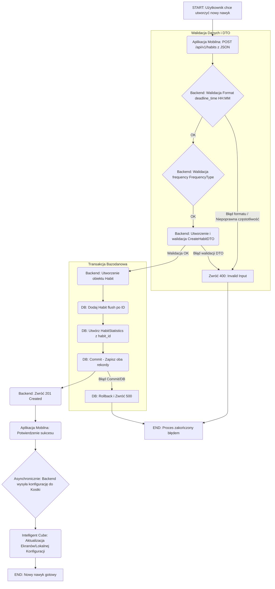
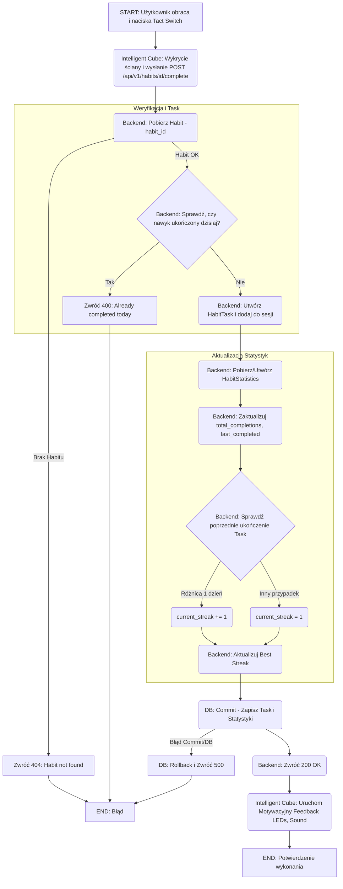
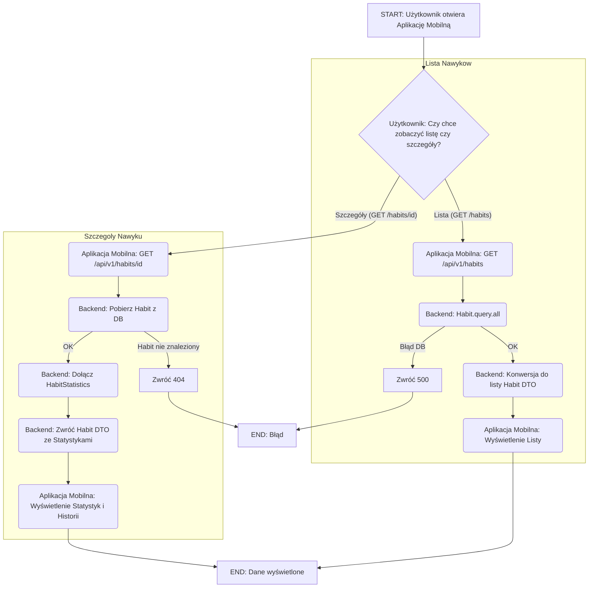

# HabCube

# Description

The "intelligent cube" is an IoT device that supports users in forming and maintaining daily habits. Habits are defined in a mobile application, which allows for their configuration and the presentation of statistics regarding progress.

# Introduction

The goal of this project is to create a complete Internet of Things (IoT) system designed to operate on a local network. The "Intelligent Cube" is an IoT device that supports users in building and maintaining daily habits. The system combines hardware (the physical cube) with a mobile application that allows users to define, configure, and track their habits, as well as view statistics on their progress.

The project integrates knowledge from electronics, computer science, network programming, and embedded systems engineering. The work covers both the hardware layer (the cube's design and implementation) and the software layer (server-side communication, backend, mobile user interface, and overall system integration).

# Project Goals

## General Goals

- To create a fully functional IoT system operating within a local network.

- To achieve high effectiveness in helping users build and sustain positive habits.

- To design a system that increases user motivation and engagement in the process of self-improvement.

- To develop a final product that genuinely improves users' quality of life by supporting them in achieving their habit-related goals.

## Educational Goals

- To understand the practical aspects of building end-to-end IoT systems.

- To learn how to integrate hardware and software into a single cohesive system.

- To develop teamwork and project management skills.

- To gain experience in planning, implementing, testing, and documenting a complex technical project.

- To learn which motivational mechanisms are most effective in habit formation and how to design engaging and intuitive user interactions.

# Project Scope

## Key Features

- **Habit Configuration**: Defining and managing habits through a mobile application.

- **Progress Tracking**: Monitoring user progress and presenting it through statistics.

- **Motivational Feedback**: Providing users with visual, sound, and light-based "dopamine hits" to reinforce positive actions.

## System Architecture

The system consists of three main components:

- The Intelligent Cube: A physical device based on an ESP32 microcontroller that acts as the primary user interaction point.

- Central Server: A backend service responsible for handling communication with the cube, processing data, and storing user statistics.

- Mobile Application: A user interface for configuring the cube, defining habits, and viewing progress data.

All components communicate over a local Wi-Fi network.

# Tools and Technologies

Hardware: ESP32, 4 OLED Screens(I2C, SPI), gyroscope, Multiplexer, 2 Tact switches, audio amplifier, speaker, leds.

Software:

Backend: To be determined Python with FastAPI.

Mobile App/UI: To be determined.

Database: PostgreSQL.

Project Management: GitHub Project (Kanban board).

Version Control: Git, GitHub.

# Expected Results

The final outcome of the project will be a functional IoT system that enables:

- Configuration and management of daily habits via a mobile app.

- Physical interaction with the cube to confirm habit completion.

- Real-time motivational feedback to the user.

- Visualization of progress data and statistics.

# Team

Piotr Ziobrowski - embedded programming

Szymon Domagała - frontend, UI

Paweł Klocek - database, documentation

Aleksy Dąda - backend, docker

Patryk Kurek - hardware and embedded programmming and tech menago

---

## Development Setup

### Konfiguracja środowiska

Polecam podpiac pre-commit (jest niżej how-to)

#### WAŻNE:

W pierwszej kolejnosci uruchom skrypt setup, który automatycznie doda export CURRENT_UID do ~/.bashrc (unikniemy potem ew. problemow z permissions do plikow i folderow):

```bash
./setup-env.sh
source ~/.bashrc
```

### Pierwsze uruchomienie

```bash
# 1. Build obrazu
docker-compose up -d --build

# 2. Status kontenerow (lub w GUI)
docker-compose ps

# 3. Logi
docker-compose logs -f backend

# 4. Check apki
curl http://localhost:5000/health
```

### Uruchomienie

```bash
# Można uruchomić tak lub MAKEFILE'em
docker-compose up -d

# Stop
docker-compose down
```

### Użycie Makefile (polecanko)

Makefile automatycznie eksportuje CURRENT_UID:

```bash
make init      # Pierwsze uruchomienie
make up        # Uruchom
make down      # Zatrzymaj
make logs      # Zobacz logi
make test      # Uruchom testy
make help      # Zobacz wszystkie komendy
```

### Serwisy

- Backend: http://localhost:5000
- Adminer (DB UI): http://localhost:8080
- PostgreSQL: localhost:5432
- Redis: localhost:6379

### Komendy

```bash
# Basic
docker-compose up -d
docker-compose down
docker-compose logs -f
docker-compose ps

# Rebuild
docker-compose build
docker-compose up -d --build

# Shell
docker-compose exec backend bash

# Testy i CQ
docker-compose exec backend pytest
docker-compose exec backend pytest --cov=app
docker-compose exec backend flake8 app/
docker-compose exec backend black app/
docker-compose exec backend pylint app/
docker-compose exec backend mypy app/

# Baza danych
docker-compose exec postgres psql -U habcube_user -d habcube
docker-compose exec backend flask db migrate -m "opis"
docker-compose exec backend flask db upgrade

# Makefile też jest
make help
```

### Pre-commit hook

Pre-commit hook uruchamia checki kodu

```bash
# 1. Utworzenie symlinku do hooka
ln -sf ../../pre-commit .git/hooks/pre-commit

# 2. Permissions
chmod +x pre-commit
```

Sprawdza:

- Black (formatowanie), isort (sortowanie importów)
- Flake8 (style), Pylint (jakość), MyPy (typy)

Można też uruchamiać ręcznie:

```bash
make lint      # Sprawdź kod
make format    # Auto-formatowanie
make test      # Uruchom testy
make quality   # all ekskljuziw
```
---
# Baza danych
### Table: `habits`
Main table containing defined habits.

| Column | Type | Description |
|--------|------|-------------|
| `id` | INTEGER PRIMARY KEY | Unique habit identifier |
| `name` | VARCHAR(100) | Name of the habit (e.g., "Drink water") |
| `description` | TEXT | Optional description or motivation |
| `deadline_time` | TIME | Deadline for completing the habit (e.g., 21:00) |
| `frequency` | ENUM('daily', 'weekly', 'custom') | How often the habit should be repeated |
| `active` | BOOLEAN DEFAULT TRUE | Whether the habit is active |
| `created_at` | TIMESTAMP DEFAULT CURRENT_TIMESTAMP | When the habit was created |
| `color` | VARCHAR(10) | LED or OLED color associated with the habit |


### Table: `habit_tasks`
Each record represents one scheduled occurrence of a habit (e.g., daily task).
Used for history and streak tracking.

| Column | Type | Description |
|--------|------|-------------|
| `id` | INTEGER PRIMARY KEY | Unique task identifier |
| `habit_id` | INTEGER REFERENCES habits(id) | Related habit |
| `date` | DATE | Date for this habit occurrence |
| `completed` | BOOLEAN DEFAULT FALSE | Whether it was completed |
| `completion_time` | TIMESTAMP NULL | When it was completed |


### Table: `habit_statistics`
Aggregated habit statistics, updated after each completion.

| Column | Type | Description |
|--------|------|-------------|
| `id` | INTEGER PRIMARY KEY | Unique statistics record |
| `habit_id` | INTEGER REFERENCES habits(id) | Related habit |
| `total_completions` | INTEGER DEFAULT 0 | Total number of completions |
| `current_streak` | INTEGER DEFAULT 0 | Current streak of consecutive days |
| `best_streak` | INTEGER DEFAULT 0 | Longest streak achieved |
| `success_rate` | FLOAT DEFAULT 0 | Percentage of successful completions |
| `last_completed` | DATE NULL | Last completion date |
| `updated_at` | TIMESTAMP DEFAULT CURRENT_TIMESTAMP | Last update time |

## Diagram ERD:


---
# Przepływ danych
### 1. Konfiguracja i Tworzenie Nowego Nawyku



### 2. Wykonanie i Potwierdzenie Nawyku (Interakcja z Kostką)


### 3. Monitorowanie Postępów i Statystyk


## 4. Szczegółowe Funkcjonalności Systemu HabCube
### 4.1 Funkcjonalności Aplikacji Mobilnej (UI/Frontend)
| Lp. | Kategoria | Funkcjonalność | Opis |
| :--- | :--- | :--- | :--- |
| **A1** | **Zarządzanie Nawykami** | **Tworzenie/Konfiguracja Nawyku** | Umożliwia dodanie nowego nawyku (nazwa, opis), ustawienie **częstotliwości** (`daily`, `weekly`, etc.) oraz opcjonalnego **deadline'u** (`HH:MM`). |
| **A2** | **Zarządzanie Nawykami** | **Aktywacja Dziennego Zestawu** | Użytkownik **ręcznie aktywuje** listę nawyków, które chce wykonywać danego dnia. Lista ta jest następnie przesyłana do kostki. |
| **A3** | **Zarządzanie Nawykami** | **Edycja/Usuwanie** | Umożliwia modyfikację parametrów istniejącego nawyku lub jego całkowite usunięcie z systemu. |
| **A4** | **Monitorowanie** | **Wizualizacja Postępów** | Prezentacja statystyk dla każdego nawyku: **Total Completions**, **Current Streak**, **Best Streak**. |
| **A5** | **Monitorowanie** | **Historia Ukończeń** | Wyświetlanie szczegółowego kalendarza lub listy zadań (`HabitTask`) z datami i czasem ukończenia. |
| **A6** | **Interakcja z Kostką** | **Łączenie/Konfiguracja** | Umożliwia połączenie się z kostką w sieci lokalnej oraz **przypisanie nawyku do ekranów** kostki. |

### 4.2 Funkcjonalności Intelligent Cube (Hardware)
| Lp. | Kategoria | Funkcjonalność | Opis |
| :--- | :--- | :--- | :--- |
| **C1** | **Wyświetlanie Stanu** | **Wyświetlanie Nawyków** | **Ekrany OLED** wyświetlają  **aktywny nawyk** na dany dzień, wraz z jego aktualnym statusem. |
| **C2** | **Interakcja** | **Zmiana Aktywnego Nawyku (Tact Switch)** | **Wciśnięcie przycisku Tact Switch** na aktywnej ścianie powoduje zmianę wyświetlanego nawyku (np. z "Czytanie" na "Bieganie"). |
| **C3** | **Interakcja** | **Potwierdzenie Ukończenia (Obrót)** | **Obrócenie kostki** na ścianę - wykryty przez **Żyroskop**) jest interpretowane jako potwierdzenie ukończenia zadania. |
| **C4** | **Motywacja** | **Feedback Zmysłowy** | Po pomyślnym ukończeniu nawyku (C3) kostka dostarcza **Motywacyjny Feedback** ("dopamine hit"): **LEDy** migają, a **Głośnik** odtwarza dźwięk. |
| **C5** | **Komunikacja** | **Wysyłanie Danych** | Po potwierdzeniu (C3), kostka wysyła żądanie `POST /api/v1/habits/{id}/complete` do Serwera Centralnego, rejestrując wykonanie. |
| **C6** | **Komunikacja** | **Odbiór Konfiguracji** | Kostka odbiera z Serwera Centralnego listę aktywnych nawyków na dany dzień i dynamicznie aktualizuje swoje wyświetlacze. |
---

## Deployment na Google Cloud (TO TYLKO DLA ADMINA A.D)

Aplikacja jest gotowa do wdrożenia na Google Cloud Platform z następującymi serwisami:

- **Cloud Run** - Serverless backend Flask
- **Cloud SQL for PostgreSQL** - Zarządzana baza danych
- **Memorystore for Redis** - Zarządzany cache
- **Secret Manager** - Bezpieczne przechowywanie credentials
- **Artifact Registry** - Rejestr obrazów Docker


### Korzystanie z API (GCLOUD)

1. gcloud auth login

2. Wygenerować TOKENA

```
    TOKEN=$(gcloud auth print-identity-token)
  ```

3. Można Curlować

``` curl https://backend-1089871134307.europe-west1.run.app/api/v1/habits

```

Powinno banglać

---

## Changelog

### 2025-10-20

**Google Cloud Deployment Ready**

- **Backend Configuration**

  - Zaktualizowano `config.py` do obsługi Cloud SQL (127.0.0.1) i Memorystore
  - Dodano wsparcie dla zmiennych środowiskowych: `DB_HOST`, `DB_USER`, `REDIS_HOST`, etc.
  - Zachowano kompatybilność z lokalnym Docker Compose

- **Dockerfile Improvements**

  - Dodano wsparcie dla zmiennej `PORT` (wymaganej przez Cloud Run)
  - Zaktualizowano CMD do używania `${PORT:-5000}`
  - Health check używa dynamicznego portu

- **Deployment Tools**
  - Utworzono `deploy-gcloud.sh` - interaktywny skrypt deployment
  - Utworzono `.env.gcloud.template` - szablon konfiguracji dla GCP

### 2025-10-15

**Habits API - Initial Implementation**

- **Modele**

  - Utworzono model `Habit` - przechowywanie nawyków użytkownika
  - Utworzono model `HabitTask` - rejestrowanie wykonań nawyków
  - Utworzono model `HabitStatistics` - statystyki i streaki
  - Dodano migracje bazy danych

- **Enumy i DTO**

  - `FrequencyType` enum: every_30_min, hourly, every_3_hours, every_6_hours, daily, weekly, monthly
  - `CreateHabitDTO` - walidacja danych wejściowych
  - `HabitResponseDTO` - format odpowiedzi API

- **ENDPOINTY**

  - `GET /api/v1/habits` - lista wszystkich nawyków
  - `GET /api/v1/habits/{id}` - szczegóły nawyku ze statystykami
  - `POST /api/v1/habits` - tworzenie nowego nawyku
  - `POST /api/v1/habits/{id}/complete` - oznaczanie nawyku jako ukończony

- **Dokumentacja API**

  - Integracja Swagger/Flasgger
  - Przykłady request/response dla każdego endpointa
  - Dostępna pod: http://localhost:5000/api/docs/

- **Testy**
  - Testy dla wszystkich endpointów
  - Testy walidacji danych
  - Testy błędnych przypadków (404, 400)
  - Testy trackowania statystyk i streaków

https://github.com/amora-labs/micropython-captive-portal/blob/master/captive.py