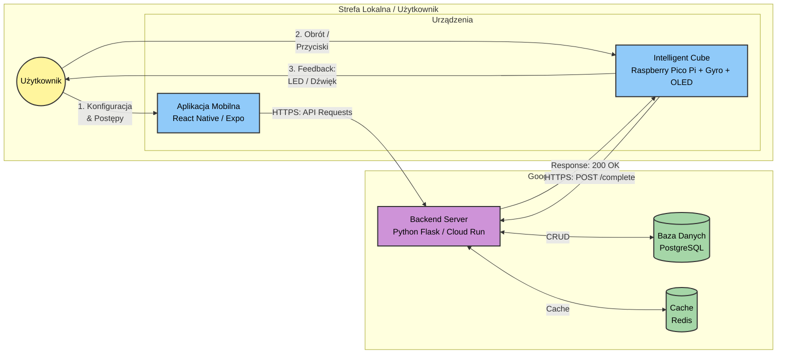
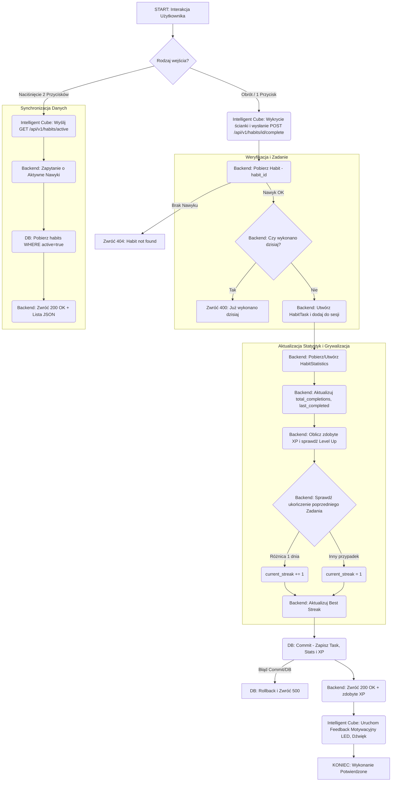
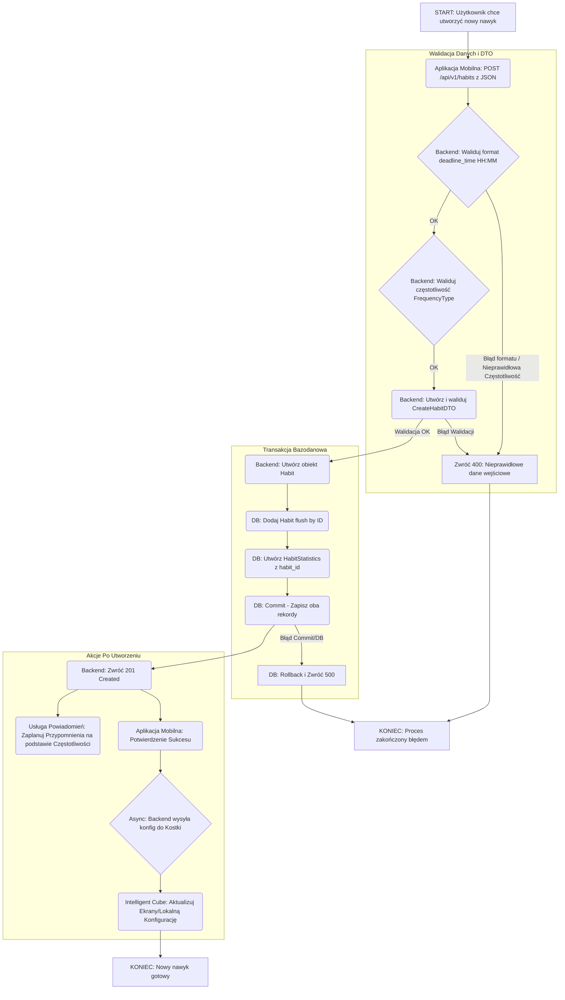
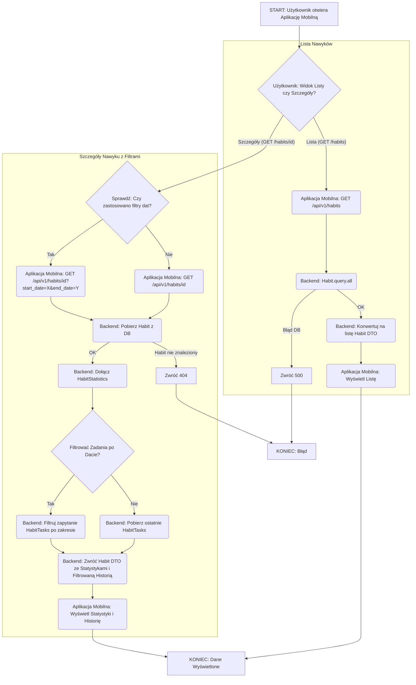

# Główny schemat przepływu danych systemu 

## Interakcja z kostką - wykonywanie i potwierdzanie nawyków 
Diagram przedstawia proces interakcji użytkownika z kostką: od wykonania nawyku (obrót/przycisk), poprzez weryfikację na backendzie i aktualizację statystyk, aż po informację zwrotną (LED/dźwięk). Uwzględniono również nową funkcjonalność: pobieranie listy nawyków poprzez naciśnięcie dwóch przycisków.

## Konfiguracja i Dodawanie nowego nawyku
Diagram ilustruje proces tworzenia nowego nawyku w aplikacji mobilnej, weryfikację danych na serwerze, zapis do bazy oraz synchronizację konfiguracji z kostką.

## Monitorowanie progresu wykonywania nawyków i statystyki
Diagram prezentuje przepływ danych podczas przeglądania listy nawyków oraz szczegółowych statystyk w aplikacji mobilnej, z uwzględnieniem filtrowania dat.

