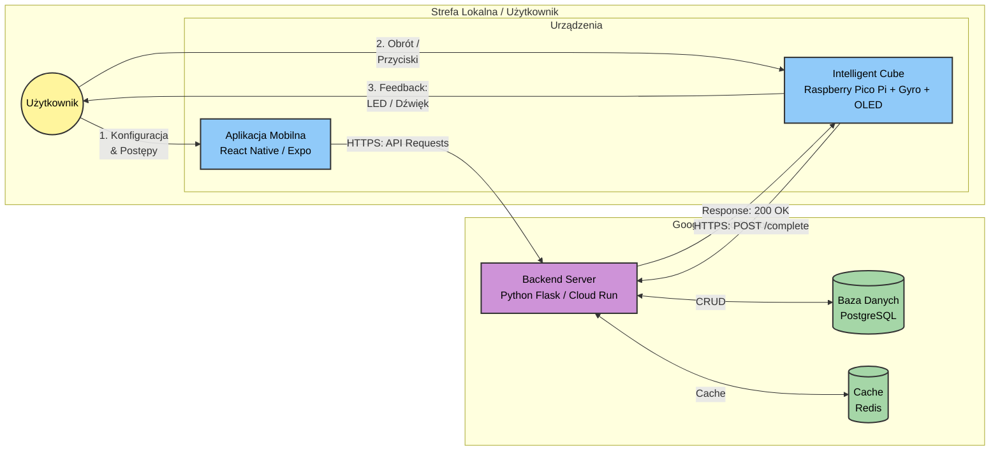
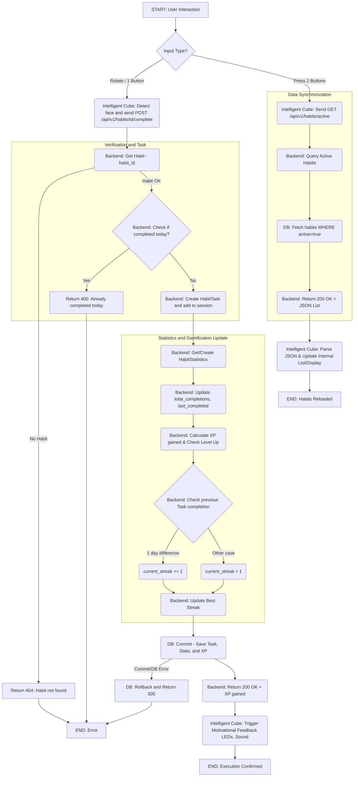

# Główny schemat przepływu danych systemu 

```mermaid
graph LR
    %% Zmiana kierunku na LR (Left-Right) zapobiega ścisku i nachodzeniu okienek
    
    subgraph Local_Network [Strefa Lokalna / Użytkownik]
        direction TB
        User((Użytkownik))
        
        subgraph Devices [Urządzenia]
            direction TB
            Mobile[Aplikacja Mobilna<br>React Native / Expo]
            Cube[Intelligent Cube<br>Raspberry Pico Pi + Gyro + OLED]
        end
    end

    subgraph Cloud_Infrastructure [Google Cloud Platform]
        direction TB
        Server[ Backend Server<br>Python Flask / Cloud Run]
        DB[(Baza Danych<br>PostgreSQL)]
        Redis[(Cache<br>Redis)]
    end

    %% --- RELACJE ---
    
    %% 1. Użytkownik i jego urządzenia
    User -->|"1. Konfiguracja<br>& Postępy"| Mobile
    User -->|"2. Obrót /<br>Przyciski"| Cube
    Cube -->|"3. Feedback:<br>LED / Dźwięk"| User

    %% 2. Komunikacja z Serwerem
    Mobile -->|"HTTPS: API Requests"| Server
    
    %% 3. Cykl życia zadania (Cube <-> Server)
    Cube -->|"HTTPS: POST /complete"| Server
    
    Server -->|"Response: 200 OK"| Cube

    %% 4. Backend Logic
    Server <-->|CRUD| DB
    Server <-->|Cache| Redis

    classDef userFill fill:#fff59d,stroke:#333,stroke-width:2px,color:#000;
    classDef deviceFill fill:#90caf9,stroke:#333,stroke-width:2px,color:#000;
    classDef cloudFill fill:#ce93d8,stroke:#333,stroke-width:2px,color:#000;
    classDef dbFill fill:#a5d6a7,stroke:#333,stroke-width:2px,color:#000;

    class User userFill;
    class Mobile,Cube deviceFill;
    class Server cloudFill;
    class DB,Redis dbFill;
```

```mermaid
graph TD
    A[START: User Interaction] --> DECISION{Input Type?}

    %% --- ŚCIEŻKA 1: WYKONANIE NAWYKU (STARA) ---
    DECISION -- Rotate / 1 Button --> B(Intelligent Cube: Detect face and send POST /api/v1/habits/id/complete)
    B --> C(Backend: Get Habit - habit_id)
    C -- No Habit --> Z404[Return 404: Habit not found]

    subgraph Verification and Task
        C -- Habit OK --> D{Backend: Check if completed today?}
        D -- Yes --> Z400[Return 400: Already completed today]
        D -- No --> E(Backend: Create HabitTask and add to session)
    end

    subgraph Statistics and Gamification Update
        E --> F(Backend: Get/Create HabitStatistics)
        F --> G(Backend: Update total_completions, last_completed)
        
        %% GAMIFICATION
        G --> G1(Backend: Calculate XP gained & Check Level Up)
        
        G1 --> H{Backend: Check previous Task completion}
        H -- 1 day difference --> I(current_streak += 1)
        H -- Other case --> J(current_streak = 1)
        I --> K(Backend: Update Best Streak)
        J --> K
    end

    K --> L(DB: Commit - Save Task, Stats, and XP)
    L -- Commit/DB Error --> Z500[DB: Rollback and Return 500]

    L --> M(Backend: Return 200 OK + XP gained)
    M --> N(Intelligent Cube: Trigger Motivational Feedback LEDs, Sound)
    N --> O[END: Execution Confirmed]

    %% --- ŚCIEŻKA 2: POBRANIE LISTY NAWYKÓW (NOWA) ---
    DECISION -- Press 2 Buttons --> REQ_FETCH(Intelligent Cube: Send GET /api/v1/habits/active)
    
    subgraph Data Synchronization
        REQ_FETCH --> BE_FETCH(Backend: Query Active Habits)
        BE_FETCH --> DB_FETCH(DB: Fetch habits WHERE active=true)
        DB_FETCH --> RESP_FETCH(Backend: Return 200 OK + JSON List)
    end

    RESP_FETCH --> CUBE_UPDATE(Intelligent Cube: Parse JSON & Update Internal List/Display)
    CUBE_UPDATE --> END_FETCH[END: Habits Reloaded]
    Z404 --> ZK[END: Error]
    Z400 --> ZK
    Z500 --> ZK
```
